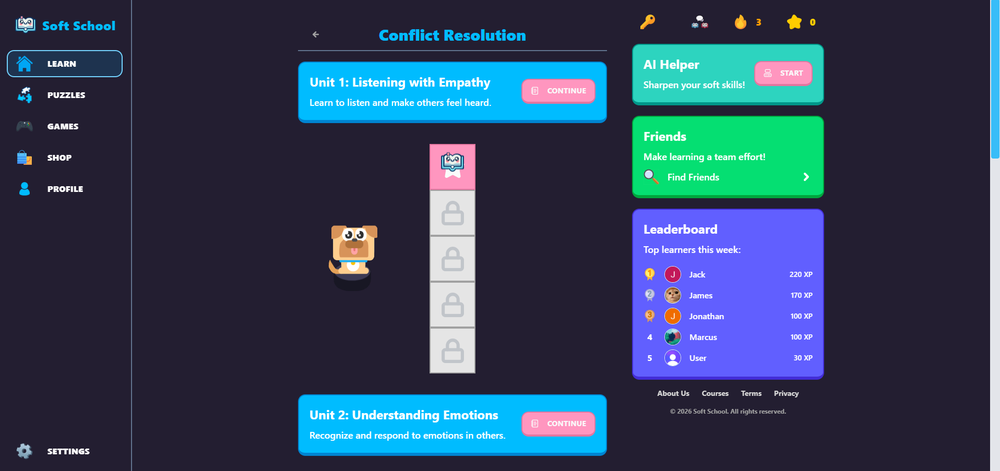
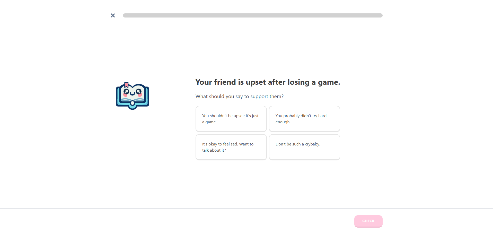
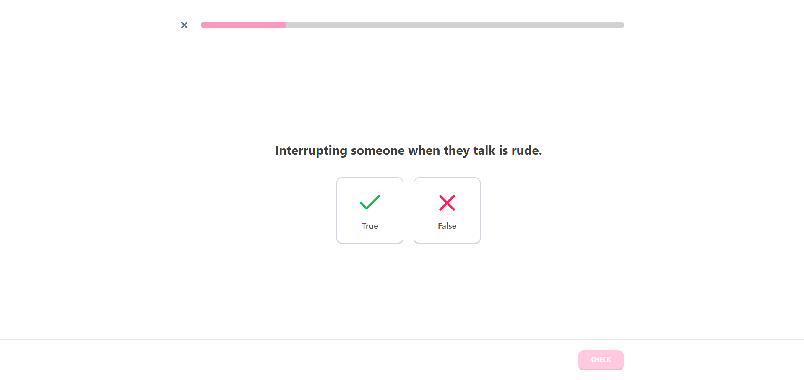
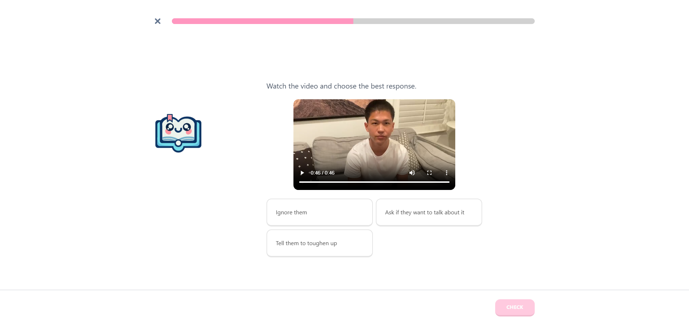
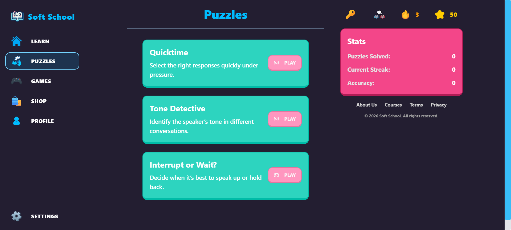
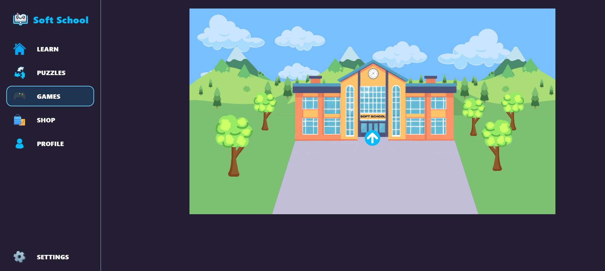

# Welcome to Soft School!

    

## What is Soft School?
[Soft School](https://softschool.ai) is a platform dedicated towards the teaching of social skills (formally recognized as "Soft Skills") to the youth, in an effort to take back deficits caused by screens world-wide.
Through interactive lessons, gamified features, and AI-powered simulations, we plan to successfully teach future generations better skills such as Conflict Resolution, Teamwork, and Problem Solving. We are currently in the MVP stage, as we are learning through trial and error to produce a platform to fulfill our mission.

## Features (WIP)
- Lessons
  - Multiple Choice
  - Select All that Apply
  - Sort
  - True False
  - Video Questions
  - Audio Questions
- Games
  - Story-based
- Puzzles
  - Quicktime Events
- Gamification
  - Lesson Streaks
  - Friends System
  - Leaderboard
  - Inventory & Cosmetics

## Screenshots

  
  
  
  
  
  

